<p align="center">
    
</p>

`merged_depth` runs (1) [AdaBins](https://github.com/shariqfarooq123/AdaBins) (NYU + KITTI models), (2) [DiverseDepth](https://github.com/YvanYin/DiverseDepth), (3) [MiDaS](https://github.com/intel-isl/MiDaS), (4) [SGDepth](https://github.com/ifnspaml/SGDepth), and (5) [Monodepth2](https://github.com/nianticlabs/monodepth2), and calculates the average predicted depth.

## Quick Start

First, download the pretrained models using the `download_models` script. Next, run the `infer` script - this will run on all images in `test/input` and save the results to `test/output`. You can use [`InferenceEngine.predict_depth(image)`](https://github.com/p-ranav/merged_depth/blob/master/merged_depth/infer.py#L335) if you just want to run the inference on a single image

```console
$ python3 -m pip install -r requirements.txt
$ python3 -m merged_depth.utils.download_models
$ python3 -m merged_depth.infer
```

## Sample Output

| <!-- -->                       | <!-- -->                        | <!-- -->                        | <!-- -->                        |
:-------------------------------:|:-------------------------------:|:-------------------------------:|:-------------------------------:|
  | 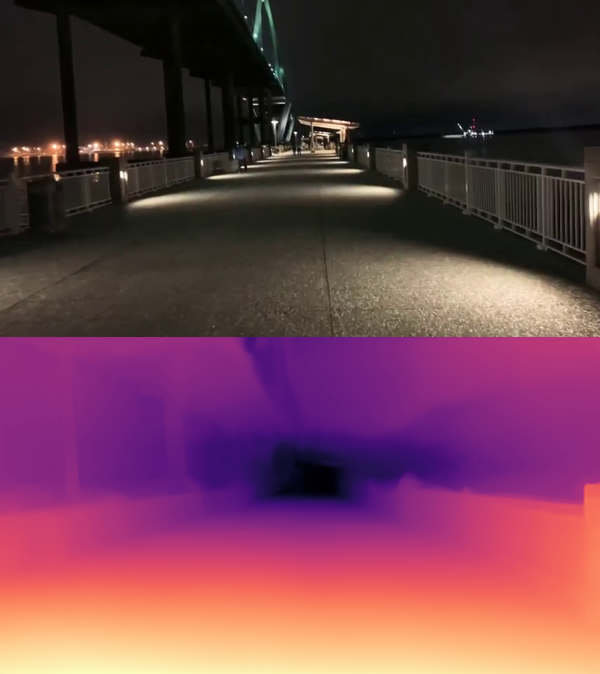 | 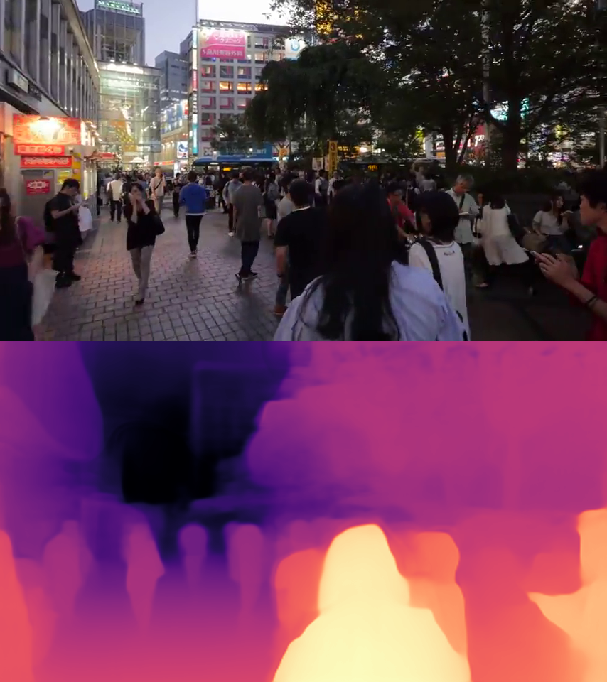 | 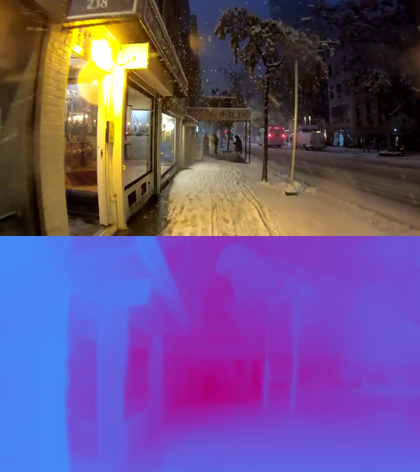 |
  |  | 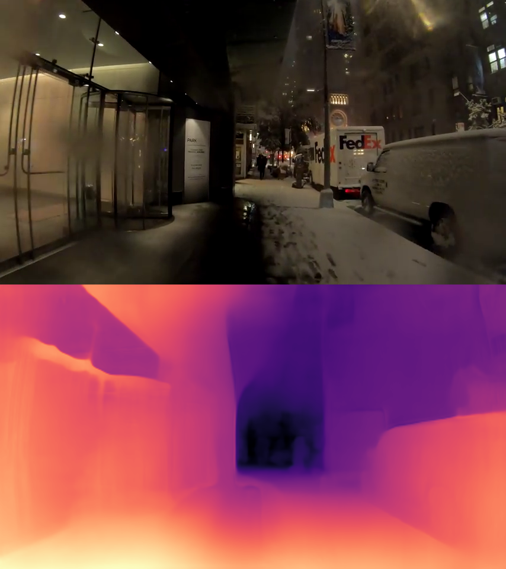 | 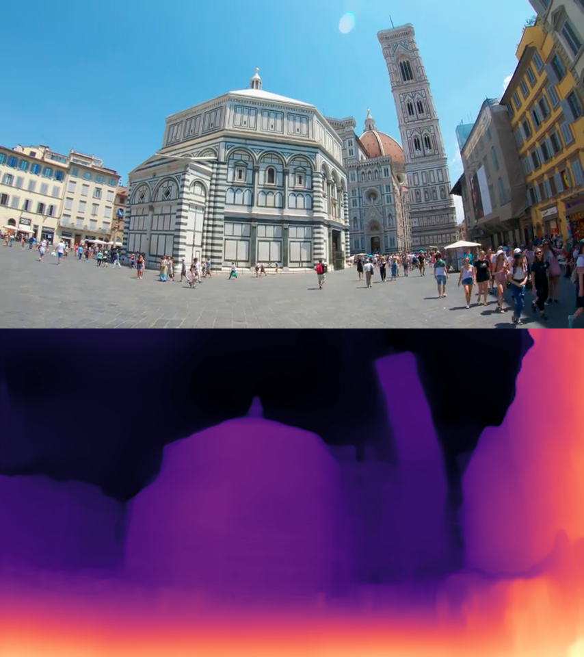 |
  |  |  | 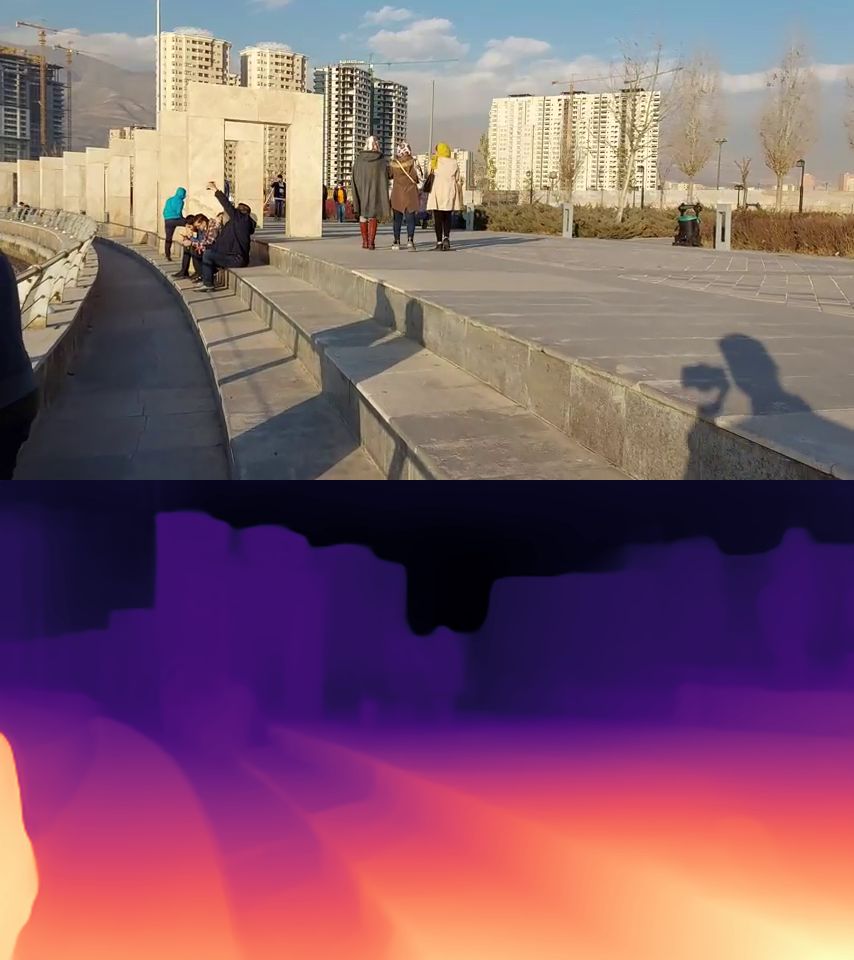 |
  |  |  | 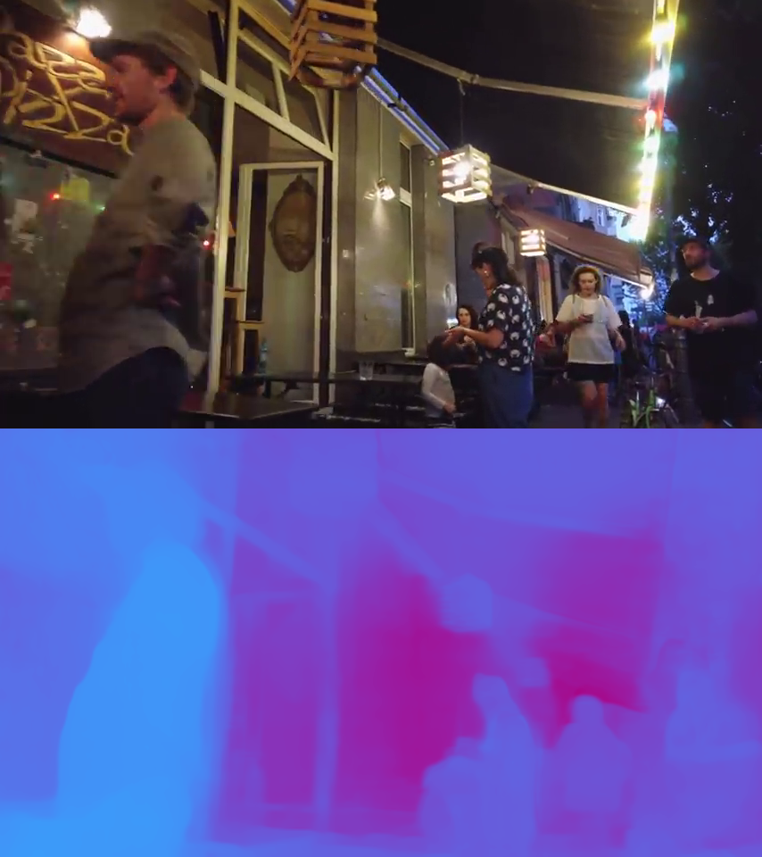 |
  | 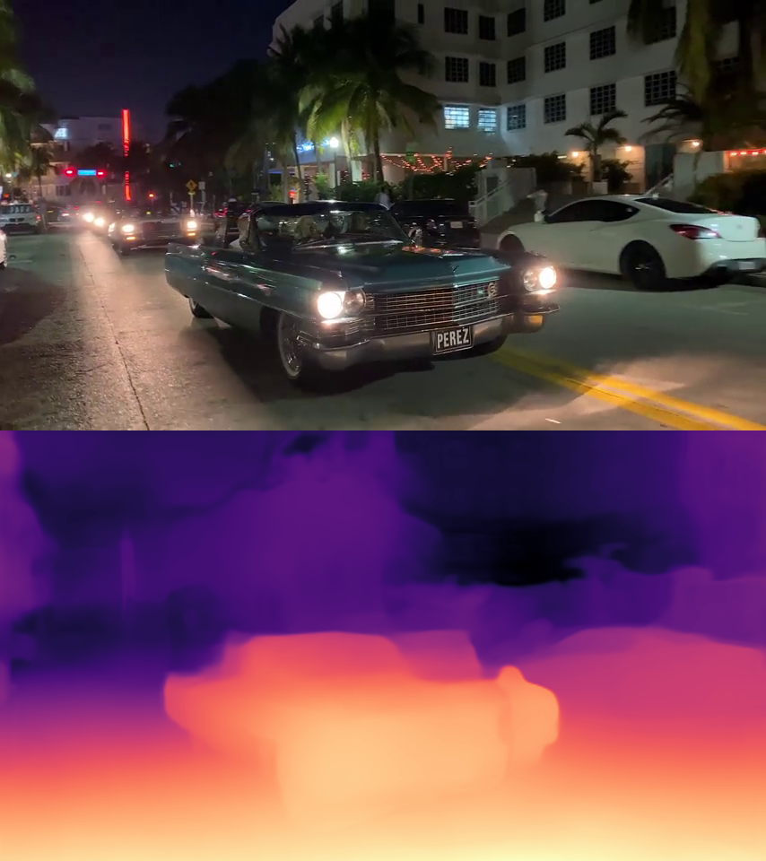 |  |  |
  |  | 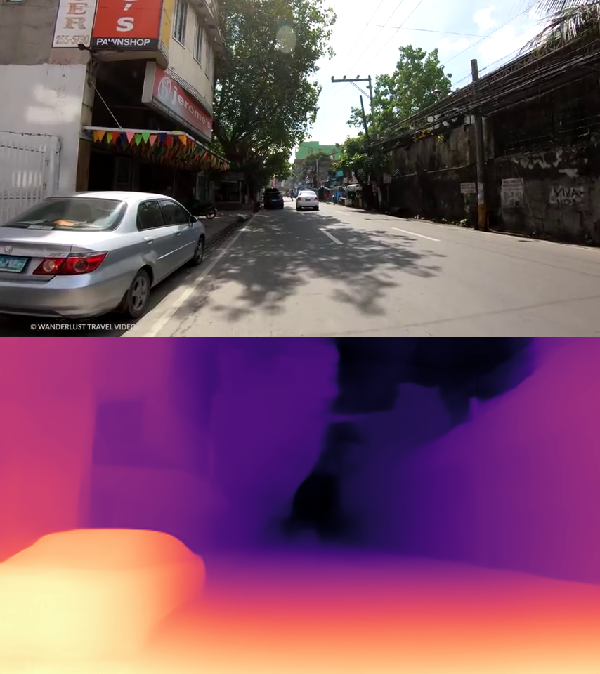 |  |
  |  |  |  |
  | 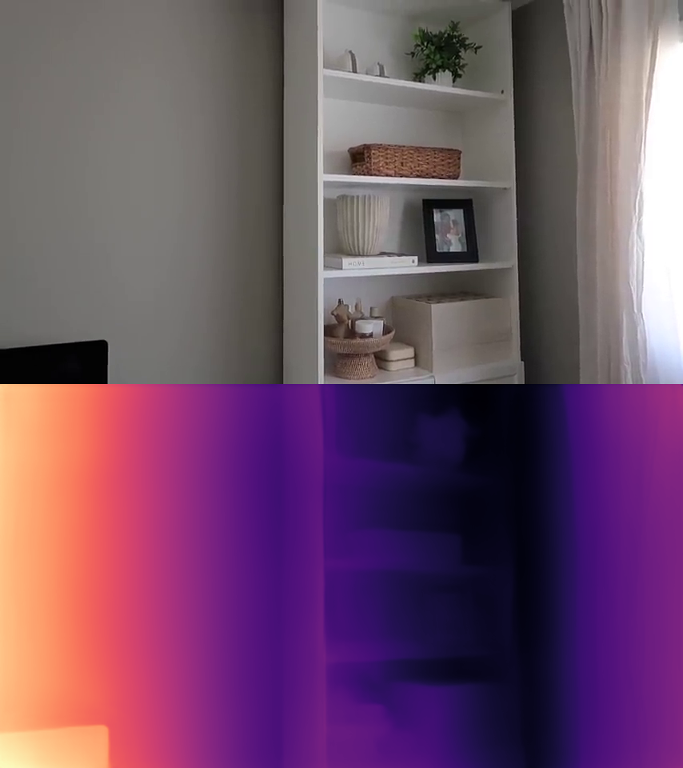 | 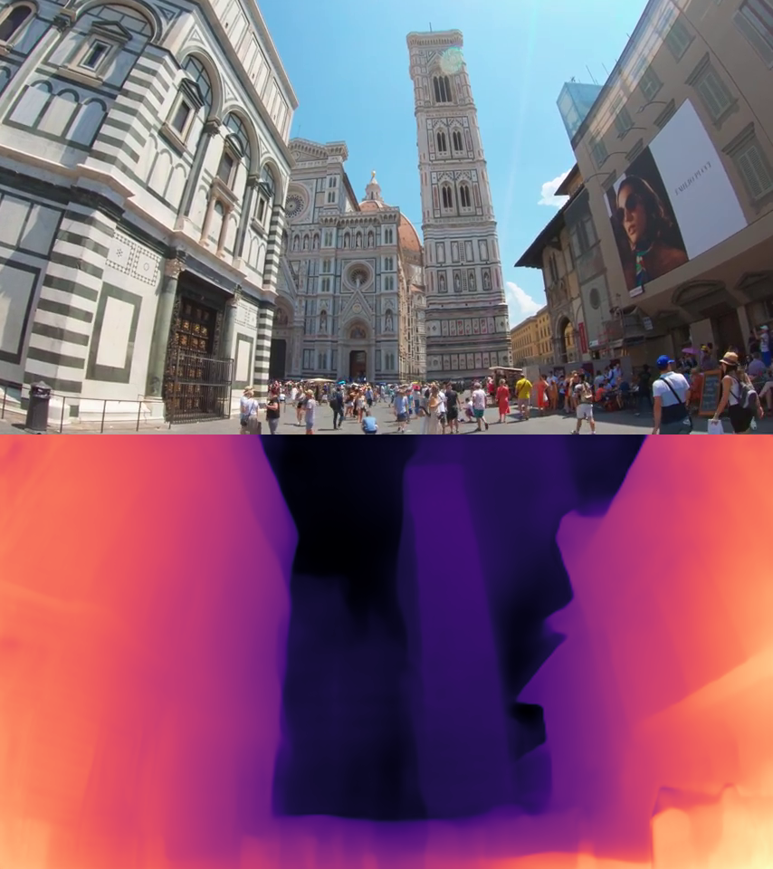 | 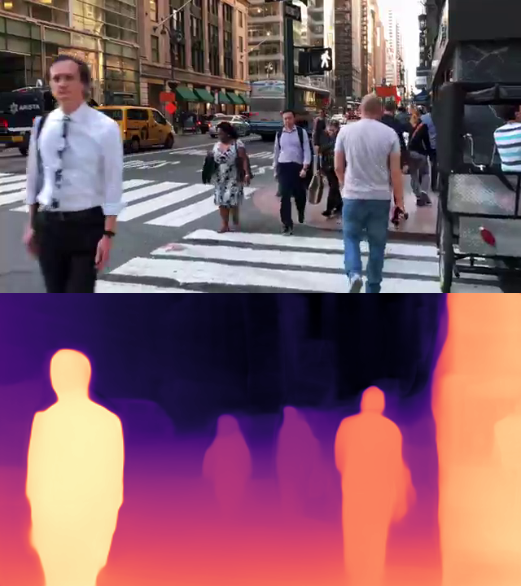 |
